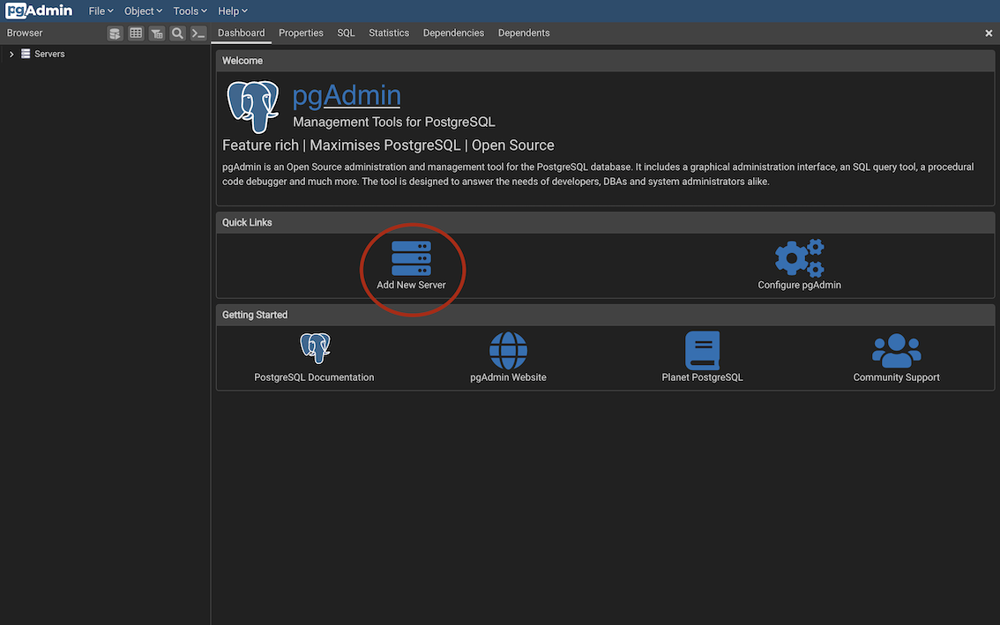
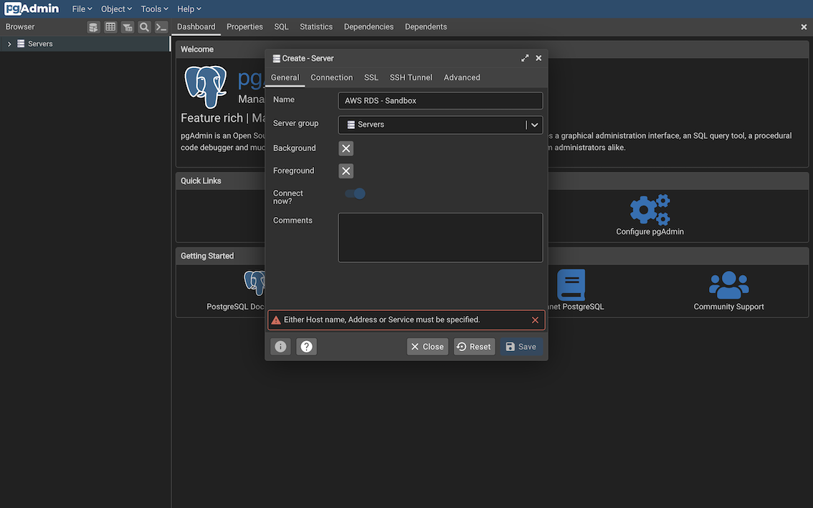
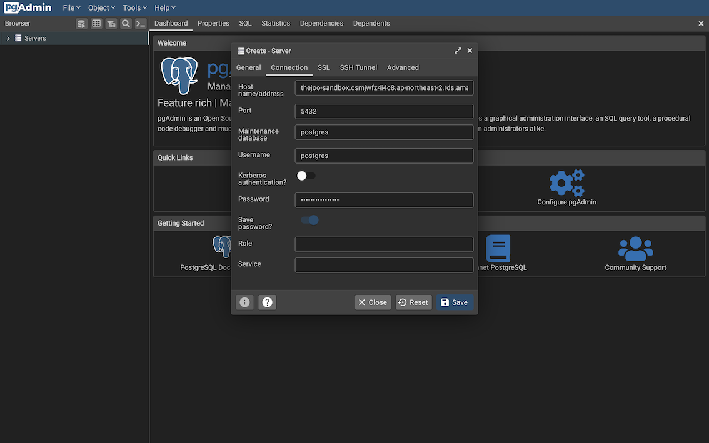

# The Joo Main Service

- [The Joo Main Service](#the-joo-main-service)
  - [프로젝트 설정](#프로젝트-설정)
    - [JetBrain IntelliJ 설치](#jetbrain-intellij-설치)
    - [Java 설치](#java-설치)
    - [Gradle 설치 (Optional)](#gradle-설치-optional)
    - [PostgreSQL 설치 및 설정](#postgresql-설치-및-설정)
    - [실행 가이드](#실행-가이드)
  - [Dependencies](#dependencies)
  - [Maintainers](#maintainers)

## 프로젝트 설정

### JetBrain IntelliJ 설치

[JetBrain IntelliJ 공식 설치 URL](https://www.jetbrains.com/ko-kr/idea/download)

### Java 설치

Java 버전: AdoptOpenJDK 11

``` bash
# Mac 설치
brew install openjdk@11 # openjdk 11 설치
/usr/libexec/java_home -V # 자바 버전 확인
Matching Java Virtual Machines (1):
    11.0.11 (x86_64) "AdoptOpenJDK" - "OpenJDK 11.0.11"
export JAVA_HOME=`/usr/libexec/java_home -v 11`
```

### Gradle 설치 (Optional)

- Gradle 버전: Gradle 7.1.1 (Gradle Wrapper가 있기 때문에 필수는 아님)
- SDKMAN: SDK 관리를 위해 설치하는 것을 추천 ([공식 설치 가이드](https://sdkman.io/install))

``` bash
# Mac 설치
sdk install gradle 7.3.2
gradle -v
------------------------------------------------------------
Gradle 7.3.2
------------------------------------------------------------

Build time:   2021-12-15 11:22:31 UTC
Revision:     26c186eb63b2b02e68d83b0dbc6ec69ab118653a

Kotlin:       1.5.31
Groovy:       3.0.9
Ant:          Apache Ant(TM) version 1.10.11 compiled on July 10 2021
JVM:          11.0.11 (AdoptOpenJDK 11.0.11+9)
OS:           Mac OS X 11.5 x86_64
```

### PostgreSQL 설치 및 설정

1. PostgreSQL 버전: 14.2 ([공식 설치 URL](https://www.enterprisedb.com/downloads/postgres-postgresql-downloads))
2. Brew를 선호하는 경우 Brew로 설치해도 무방
3. DB 세팅: TBD
4. pgAdmin에서 샌드박스 DB 연결 설정
DB 주소: thejoo-sandbox.csmjwfz4i4c8.ap-northeast-2.rds.amazonaws.com
비밀번호: 관리자에게 문의
IMPORTANT: DB 서버 Inbound ACL이 막혀있으므로 관리자에게 접속하려는 PC의 IP 주소를 제공하여야함

  

### 실행 가이드

``` bash
cd /path/to/repository
# 테스트 없이 빌드
gradle clean build -x test
# 커맨드 라인에서 서비스 실행
gradle bootRun
# 웬만하면 개발환경에서는 그냥 IntelliJ를 쓰도록 하자...
```

## Dependencies

- Java OpenJDK 11
- Gradle 7.3.2

## Maintainers

- @rostradamus (<rolee0429@gmail.com>)
